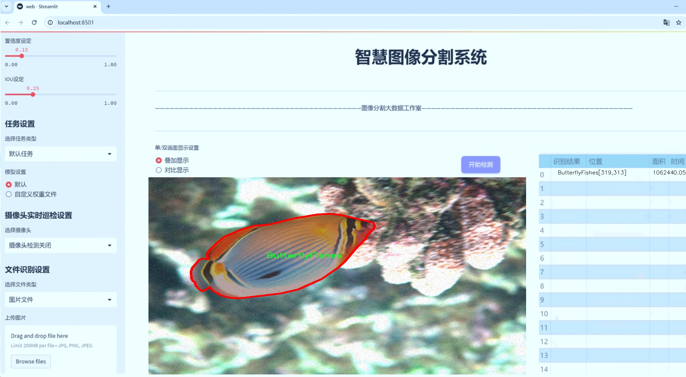

# 海洋鱼类图像分类分割系统源码＆数据集分享
 [yolov8-seg-slimneck＆yolov8-seg-attention等50+全套改进创新点发刊_一键训练教程_Web前端展示]

### 1.研究背景与意义

项目参考[ILSVRC ImageNet Large Scale Visual Recognition Challenge](https://gitee.com/YOLOv8_YOLOv11_Segmentation_Studio/projects)

项目来源[AAAI Global Al lnnovation Contest](https://kdocs.cn/l/cszuIiCKVNis)

研究背景与意义

随着全球海洋生态系统的不断变化，海洋生物多样性面临着前所未有的挑战。鱼类作为海洋生态系统的重要组成部分，其种类繁多且生态功能显著，因此对鱼类的监测与保护显得尤为重要。近年来，计算机视觉技术的迅猛发展为海洋生物的识别与分类提供了新的可能性，尤其是基于深度学习的图像处理技术，已在许多领域取得了显著成效。YOLO（You Only Look Once）系列模型因其高效的实时目标检测能力而备受关注，其中YOLOv8作为最新版本，具备更强的特征提取能力和更快的处理速度，适合应用于复杂的海洋环境中。

本研究旨在基于改进的YOLOv8模型，构建一个高效的海洋鱼类图像分类与分割系统。我们使用的数据集“ld_fishes-2024”包含2000张图像，涵盖126个鱼类类别，这为模型的训练和验证提供了丰富的样本基础。数据集中不仅包括了多种常见的鱼类，如黑斑军舰鱼、粉蓝唐鱼等，还涵盖了多种特殊鱼类，如雪花鳗和印度狮子鱼等。这种多样性使得模型在实际应用中能够具备更强的泛化能力和适应性。

通过对鱼类图像的自动分类与分割，不仅可以提高海洋生物监测的效率，还能为科学研究提供重要的数据支持。鱼类的种类、数量及其分布情况直接反映了海洋生态环境的健康状况，因此，构建一个高效的分类分割系统对于海洋生态保护、资源管理及可持续发展具有重要意义。此外，基于深度学习的图像处理技术还可以应用于其他海洋生物的监测与研究，推动海洋科学的进步。

本研究的意义还在于，通过改进YOLOv8模型，我们可以探索深度学习在海洋生物分类中的新应用。相比传统的图像处理方法，深度学习能够自动提取特征，减少人工干预，提高分类精度。同时，结合实例分割技术，我们能够实现对鱼类的精确定位和识别，为后续的生态研究提供更为详实的数据。这一系统的成功构建，将为海洋生物多样性保护提供新的技术手段，促进科学研究与实践的结合。

综上所述，基于改进YOLOv8的海洋鱼类图像分类分割系统的研究，不仅具有重要的学术价值，还对实际的海洋生态保护工作具有深远的影响。通过这一研究，我们希望能够为海洋生物监测提供更为高效、准确的解决方案，助力海洋生态环境的可持续发展。

### 2.图片演示





##### 注意：由于此博客编辑较早，上面“2.图片演示”和“3.视频演示”展示的系统图片或者视频可能为老版本，新版本在老版本的基础上升级如下：（实际效果以升级的新版本为准）

  （1）适配了YOLOV8的“目标检测”模型和“实例分割”模型，通过加载相应的权重（.pt）文件即可自适应加载模型。

  （2）支持“图片识别”、“视频识别”、“摄像头实时识别”三种识别模式。

  （3）支持“图片识别”、“视频识别”、“摄像头实时识别”三种识别结果保存导出，解决手动导出（容易卡顿出现爆内存）存在的问题，识别完自动保存结果并导出到tempDir中。

  （4）支持Web前端系统中的标题、背景图等自定义修改，后面提供修改教程。

  另外本项目提供训练的数据集和训练教程,暂不提供权重文件（best.pt）,需要您按照教程进行训练后实现图片演示和Web前端界面演示的效果。

### 3.视频演示

[3.1 视频演示](https://www.bilibili.com/video/BV1xA2nYsE1v/)

### 4.数据集信息展示

##### 4.1 本项目数据集详细数据（类别数＆类别名）

nc: 82
names: ['Abudefduf septemfasciatus Nine-band Sergeant', 'Abudefduf sordidus Blackspot Sergeant', 'Abudefduf vaigiensis Indo-Pacific Sergeant Major', 'Acanthurus blochii Dark Surgeonfish', 'Acanthurus leucosternon Powder Blue Tang', 'Acanthurus lineatus Striped Surgeonfish', 'Acanthurus nigricauda Eyeline Surgeonfish India', 'Acanthurus tennentii Lieutenant Surgeonfish', 'Acanthurus triostegus Convict Surgeonfish', 'Amphiprion nigripes Blackfin Anemonefish', 'Arothron nigropunctatus Blackspotted Puffer', 'Balistapus undulatus Orangestripe Triggerfish', 'ButterflyFishes', 'CE', 'Chaetodon auriga Threadfin Butterflyfish', 'Chaetodon collare Red-tailed Butterflyfish', 'Chaetodon falcula Saddleback Butterflyfish', 'Chaetodon lunula Raccoon Butterflyfish', 'Chaetodon meyeri Meyer-s Butterflyfish', 'Chaetodon trifascialis Chevron Butterflyfish', 'Chaetodon trifasciatus Indian Redfin Butterflyfish', 'Chaetodon xanthocephalus Yellowhead Butterflyfish', 'Chlorurus capistratoides Pink-margined Parrotfish', 'Chlorurus sordidus Indian Bullethead Parrotfish', 'Chromis fieldi Indian half-and-half chromis', 'Chromis ternatensis Ternate Chromis', 'Chromis viridis Blue-green Chromis', 'Cirrhitichthys falco Dwarf Hawkfish', 'Ctenochaetus striatus Lined Bristletooth', 'DCA', 'Damselfishes_allied', 'Dascyllus abudafur Indian Ocean Humbug', 'Dascyllus carneus Indian Dascyllus', 'Diodon hystrix Spotted Porcupinefish', 'Eel', 'Epinephelus merra Honeycomb Grouper', 'Gnathodentex aureolineatus Striped Large-eye Bream', 'Goatfishes_allied', 'Gomphosus caeruleus Green Bird Wrasse', 'Groupers_allied', 'Halichoeres hortulanus Checkerboard Wrasse', 'Halichoeres lamarii Dark Green Wrasse', 'Hipposcarus harid Indian Longnose Parrotfish', 'Labroides bicolor Bicolor Cleaner Wrasse', 'Lutjanus bohar Two-spot Red Snapper', 'Lutjanus gibbus Humpback Snapper', 'Lutjanus kasmira Bluestriped Snapper', 'Lutjanus monostigma Onespot Snapper', 'Malacanthus latovittatus Blue Blanquillo', 'Melichthys indicus Black-finned Triggerfish', 'Monotaxis heterodon Redfin Bream', 'Mulloidichthys vanicolensis Yellowfin Goatfish', 'Myripristis murdjan Crimson Soldierfish', 'Myripristis violacea Violet Soldierfish', 'Naso brevirostris Paletail Unicornfish', 'Naso elegans Elegant Unicornfish', 'Neoniphon sammara Spotfin Squirrelfish', 'Otherfishes', 'Parrotfishes_allied', 'Parupeneus macronemus Longbarbel Goatfish', 'Parupeneus trifasciatus Indian Doublebar Goatfish', 'Plectorhinchus vittatus Oriental Sweetlips', 'Pomacanthus imperator Emperor Angelfish', 'Sargocentron caudimaculatum Tailspot Squirrelfish', 'Sargocentron spiniferum Longjaw squirrelfish', 'Scarus Parrotfishes_allied JUV', 'Scarus frenatus Sixband Parrotfish', 'Scarus rubroviolaceus Redlip Parrotfish', 'Scarus scaber Five-saddle Parrotfish', 'Scarus tricolor Tricolour Parrotfish', 'Snappers_allied', 'Spratelloides gracilis Slender Sprat', 'Squids', 'Squirrel_soldierfishes', 'Stegastes punctatus Bluntsnout Gregory', 'Surgeonfishes_allied', 'Sweetlips', 'Thalassoma hardwicke Sixbar Wrasse', 'Triggerfishes_allied', 'Zanclus cornutus Moorish Idol', 'butterflyfish_allied JUV', 'water_background']


##### 4.2 本项目数据集信息介绍

数据集信息展示

在本研究中，我们使用了名为“ld_fishes-2024”的数据集，旨在训练和改进YOLOv8-seg的海洋鱼类图像分类与分割系统。该数据集包含82个不同的鱼类类别，涵盖了广泛的海洋生态系统，能够为深度学习模型提供丰富的训练样本。这些类别不仅包括常见的鱼类，如九带士兵鱼（Abudefduf septemfasciatus）和黑斑士兵鱼（Abudefduf sordidus），还包括多种独特的鱼类，如优雅的独角鲸鱼（Naso elegans）和帝王海鳌（Pomacanthus imperator），展示了海洋生物的多样性和复杂性。

每个类别的命名都包含了其学名和常用名，使得数据集在科学研究和实际应用中具有较高的可读性和易用性。例如，条纹外科鱼（Acanthurus lineatus）和黑点海鳌（Arothron nigropunctatus）等鱼类，不仅在生态系统中扮演着重要角色，同时也是海洋生物多样性的重要代表。数据集中还包括了多种蝴蝶鱼（如Chaetodon auriga和Chaetodon trifasciatus），这些鱼类以其鲜艳的色彩和独特的形态而闻名，成为了海洋观赏鱼的重要组成部分。

数据集的构建经过精心设计，确保了每个类别的样本数量和质量，以便于模型在训练过程中能够有效地学习到每种鱼类的特征。除了鱼类本身，数据集中还包含了水下背景图像（如“water_background”），这对于模型在实际应用中的泛化能力至关重要。通过将鱼类图像与水下环境结合，模型能够更好地理解和识别不同鱼类在自然栖息地中的表现。

在数据集的使用过程中，我们将采用数据增强技术，以提高模型的鲁棒性和准确性。数据增强不仅可以增加训练样本的多样性，还能帮助模型适应不同的光照条件、视角和背景变化，从而提升其在实际应用中的表现。此外，数据集中的每个类别都经过了严格的标注，确保了训练过程中所用数据的准确性和可靠性。

通过“ld_fishes-2024”数据集的训练，我们期望能够开发出一个高效的海洋鱼类图像分类与分割系统。这一系统不仅可以用于科学研究，还可以在海洋保护、生态监测和商业捕捞等领域发挥重要作用。随着海洋生态环境的变化，准确识别和分类海洋生物将为保护海洋生态系统提供重要的数据支持。

总之，“ld_fishes-2024”数据集的丰富性和多样性为我们的研究提供了坚实的基础，使得我们能够在深度学习领域中进一步探索和创新。通过不断优化YOLOv8-seg模型，我们希望能够实现更高效的海洋鱼类识别与分割，为海洋生物的保护和研究贡献力量。


### 5.全套项目环境部署视频教程（零基础手把手教学）

[5.1 环境部署教程链接（零基础手把手教学）](https://www.bilibili.com/video/BV1jG4Ve4E9t/?vd_source=bc9aec86d164b67a7004b996143742dc)


[5.2 安装Python虚拟环境创建和依赖库安装视频教程链接（零基础手把手教学）](https://www.bilibili.com/video/BV1nA4VeYEze/?vd_source=bc9aec86d164b67a7004b996143742dc)

### 6.手把手YOLOV8-seg训练视频教程（零基础小白有手就能学会）

[6.1 手把手YOLOV8-seg训练视频教程（零基础小白有手就能学会）](https://www.bilibili.com/video/BV1cA4VeYETe/?vd_source=bc9aec86d164b67a7004b996143742dc)


按照上面的训练视频教程链接加载项目提供的数据集，运行train.py即可开始训练



     Epoch   gpu_mem       box       obj       cls    labels  img_size
     1/200     0G   0.01576   0.01955  0.007536        22      1280: 100%|██████████| 849/849 [14:42<00:00,  1.04s/it]
               Class     Images     Labels          P          R     mAP@.5 mAP@.5:.95: 100%|██████████| 213/213 [01:14<00:00,  2.87it/s]
                 all       3395      17314      0.994      0.957      0.0957      0.0843

     Epoch   gpu_mem       box       obj       cls    labels  img_size
     2/200     0G   0.01578   0.01923  0.007006        22      1280: 100%|██████████| 849/849 [14:44<00:00,  1.04s/it]
               Class     Images     Labels          P          R     mAP@.5 mAP@.5:.95: 100%|██████████| 213/213 [01:12<00:00,  2.95it/s]
                 all       3395      17314      0.996      0.956      0.0957      0.0845

     Epoch   gpu_mem       box       obj       cls    labels  img_size
     3/200     0G   0.01561    0.0191  0.006895        27      1280: 100%|██████████| 849/849 [10:56<00:00,  1.29it/s]
               Class     Images     Labels          P          R     mAP@.5 mAP@.5:.95: 100%|███████   | 187/213 [00:52<00:00,  4.04it/s]
                 all       3395      17314      0.996      0.957      0.0957      0.0845


### 7.50+种全套YOLOV8-seg创新点代码加载调参视频教程（一键加载写好的改进模型的配置文件）

[7.1 50+种全套YOLOV8-seg创新点代码加载调参视频教程（一键加载写好的改进模型的配置文件）](https://www.bilibili.com/video/BV1Hw4VePEXv/?vd_source=bc9aec86d164b67a7004b996143742dc)

### 8.YOLOV8-seg图像分割算法原理

原始YOLOV8-seg算法原理

YOLO（You Only Look Once）系列算法自问世以来，便以其高效的目标检测能力在计算机视觉领域占据了一席之地。YOLOv8-seg作为该系列的最新版本，进一步优化了目标检测和分割的性能，结合了深度学习的最新进展，展现出卓越的检测精度和速度。YOLOv8-seg不仅延续了YOLO系列的单阶段检测框架，还引入了更为复杂的网络结构和特征处理方法，以适应多样化的应用场景。

YOLOv8-seg的网络结构可以分为三个主要部分：Backbone、Neck和Head。Backbone部分负责特征提取，Neck部分则用于特征融合，而Head部分则执行最终的目标检测和分割任务。这种分层设计使得YOLOv8-seg能够在不同的阶段对输入图像进行逐步处理，从而提取出更为丰富和多样的特征信息。

在Backbone部分，YOLOv8-seg采用了一系列卷积和反卷积层，结合残差连接和瓶颈结构，旨在提高网络的性能和效率。具体而言，Backbone由多个CBS模块、C2f模块和一个快速空间金字塔池化（SPPF）模块组成。CBS模块通过卷积操作提取特征，而C2f模块则通过引入不同尺度的特征通道，增强了特征的多样性和丰富性。SPPF模块则通过不同内核尺寸的池化操作，对特征图进行处理和合并，从而有效提升了特征图的表达能力。这一系列设计不仅降低了网络的复杂度，还提升了其在特征提取过程中的有效性。

Neck部分则采用了多尺度特征融合技术，旨在将来自Backbone不同阶段的特征图进行有效整合。这一过程通过特征金字塔和路径聚合网络的结合，促进了语义信息和定位信息的有效转移，使得网络能够更好地捕捉不同尺度目标的信息。这种特征融合策略显著增强了YOLOv8-seg在复杂场景下的鲁棒性和准确性，尤其是在处理小目标和复杂背景时，表现得尤为突出。

Head部分是YOLOv8-seg的核心，负责最终的目标检测和分割任务。该部分设有多个检测头，采用解耦头的结构，分别处理回归和分类任务。这种设计不仅加速了模型的收敛速度，还提高了检测的精度。每个检测头都包含一系列卷积层和反卷积层，旨在生成最终的检测结果。通过对不同尺寸目标的独立处理，YOLOv8-seg能够在各种尺度下实现高效的目标检测和分割，进一步提升了算法的适用性。

YOLOv8-seg的输入部分则负责对图像进行预处理，包括调整图像比例、实现Mosaic增强和瞄点计算等。这些预处理步骤为后续的特征提取和目标检测奠定了基础，确保了网络能够在多样化的输入条件下保持良好的性能。

值得一提的是，YOLOv8-seg在设计上充分考虑了模型的轻量化和高效性。通过使用C2f模块替代传统的C3模块，YOLOv8-seg在保证特征提取能力的同时，减少了计算资源的消耗。这一创新使得YOLOv8-seg能够在移动设备和边缘计算环境中实现实时目标检测和分割，极大地拓宽了其应用场景。

总的来说，YOLOv8-seg算法通过对Backbone、Neck和Head的精心设计与优化，展现出强大的目标检测和分割能力。其多尺度特征融合、解耦头结构以及轻量化设计，使得YOLOv8-seg在保持高效性的同时，能够处理复杂的视觉任务。随着深度学习技术的不断发展，YOLOv8-seg无疑将在未来的计算机视觉应用中发挥更为重要的作用，推动目标检测和分割技术的进一步进步。


### 9.系统功能展示（检测对象为举例，实际内容以本项目数据集为准）

图9.1.系统支持检测结果表格显示

  图9.2.系统支持置信度和IOU阈值手动调节

  图9.3.系统支持自定义加载权重文件best.pt(需要你通过步骤5中训练获得)

  图9.4.系统支持摄像头实时识别

  图9.5.系统支持图片识别

  图9.6.系统支持视频识别

  图9.7.系统支持识别结果文件自动保存

  图9.8.系统支持Excel导出检测结果数据


### 10.50+种全套YOLOV8-seg创新点原理讲解（非科班也可以轻松写刊发刊，V11版本正在科研待更新）

#### 10.1 由于篇幅限制，每个创新点的具体原理讲解就不一一展开，具体见下列网址中的创新点对应子项目的技术原理博客网址【Blog】：


[10.1 50+种全套YOLOV8-seg创新点原理讲解链接](https://gitee.com/qunmasj/good)

#### 10.2 部分改进模块原理讲解(完整的改进原理见上图和技术博客链接)【此小节的图要是加载失败请移步原始博客查看，链接：https://blog.csdn.net/cheng2333333?type=blog】

### YOLOv8简介


由上图可以看出，C2中每个BottlNeck的输入Tensor的通道数channel都只是上一级的0.5倍，因此计算量明显降低。从另一方面讲，梯度流的增加，t也能够明显提升收敛速度和收敛效果。
C2i模块首先以输入tensor(n.c.h.w)经过Conv1层进行split拆分，分成两部分(n,0.5c,h,w)，一部分直接经过n个Bottlenck，另一部分经过每一操作层后都会以(n.0.5c,h,w)的尺寸进行Shortcut，最后通过Conv2层卷积输出。也就是对应n+2的Shortcut(第一层Conv1的分支tensor和split后的tensor为2+n个bottenlenneck)。
#### Neck
YOLOv8的Neck采用了PANet结构，如下图所示。

Backbone最后SPPF模块(Layer9)之后H、W经过32倍下采样，对应地Layer4经过8倍下采样，Layer6经过16倍下采样。输入图片分辨率为640*640，得到Layer4、Layer6、Layer9的分辨率分别为80*80、40*40和20*20。
Layer4、Layer6、Layer9作为PANet结构的输入，经过上采样，通道融合，最终将PANet的三个输出分支送入到Detect head中进行Loss的计算或结果解算。
与FPN(单向，自上而下)不同的是，PANet是一个双向通路网络，引入了自下向上的路径，使得底层信息更容易传递到顶层。
#### Head
Head部分相比Yolov5改动较大，直接将耦合头改为类似Yolo的解耦头结构(Decoupled-Head)，将回归分支和预测分支分离，并针对回归分支使用了Distribution Focal Loss策略中提出的积分形式表示法。之前的目标检测网络将回归坐标作为一个确定性单值进行预测，DFL将坐标转变成一个分布。


### LSKNet的架构
该博客提出的结构层级依次为：

LSK module（大核卷积序列+空间选择机制） < LSK Block （LK Selection + FFN）<LSKNet（N个LSK Block）


#### LSK 模块

LSK Block
LSKNet 是主干网络中的一个可重复堆叠的块（Block），每个LSK Block包括两个残差子块，即大核选择子块（Large Kernel Selection，LK Selection）和前馈网络子块（Feed-forward Network ，FFN），如图8。LK Selection子块根据需要动态地调整网络的感受野，FFN子块用于通道混合和特征细化，由一个全连接层、一个深度卷积、一个 GELU 激活和第二个全连接层组成。

LSK module（LSK 模块，图4）由一个大核卷积序列（large kernel convolutions）和一个空间核选择机制（spatial kernel selection mechanism）组成，被嵌入到了LSK Block 的 LK Selection子块中。

#### Large Kernel Convolutions
因为不同类型的目标对背景信息的需求不同，这就需要模型能够自适应选择不同大小的背景范围。因此，作者通过解耦出一系列具有大卷积核、且不断扩张的Depth-wise 卷积，构建了一个更大感受野的网络。

具体地，假设序列中第i个Depth-wise 卷积核的大小为 ，扩张率为 d，感受野为 ，它们满足以下关系：


卷积核大小和扩张率的增加保证了感受野能够快速增大。此外，我们设置了扩张率的上限，以保证扩张卷积不会引入特征图之间的差距。


Table2的卷积核大小可根据公式（1）和（2）计算，详见下图：


这样设计的好处有两点。首先，能够产生具有多种不同大小感受野的特征，便于后续的核选择；第二，序列解耦比简单的使用一个大型卷积核效果更好。如上图表2所示，解耦操作相对于标准的大型卷积核，有效地将低了模型的参数量。

为了从输入数据  的不同区域获取丰富的背景信息特征，可采用一系列解耦的、不用感受野的Depth-wise 卷积核：


其中，是卷积核为 、扩张率为  的Depth-wise 卷积操作。假设有个解耦的卷积核，每个卷积操作后又要经过一个的卷积层进行空间特征向量的通道融合。


之后，针对不同的目标，可基于获取的多尺度特征，通过下文中的选择机制动态选择合适的卷积核大小。

这一段的意思可以简单理解为：

把一个大的卷积核拆成了几个小的卷积核，比如一个大小为5，扩张率为1的卷积核加上一个大小为7，扩张率为3的卷积核，感受野为23，与一个大小为23，扩张率为1的卷积核的感受野是一样的。因此可用两个小的卷积核替代一个大的卷积核，同理一个大小为29的卷积核也可以用三个小的卷积代替（Table 2），这样可以有效的减少参数，且更灵活。

将输入数据依次通过这些小的卷积核（公式3），并在每个小的卷积核后面接上一个1×1的卷积进行通道融合（公式4）。

#### Spatial Kernel Selection
为了使模型更关注目标在空间上的重点背景信息，作者使用空间选择机制从不同尺度的大卷积核中对特征图进行空间选择。

首先，将来自于不同感受野卷积核的特征进行concate拼接，然后，应用通道级的平均池化和最大池化提取空间关系，其中， 和  是平均池化和最大池化后的空间特征描述符。为了实现不同空间描述符的信息交互，作者利用卷积层将空间池化特征进行拼接，将2个通道的池化特征转换为N个空间注意力特征图，之后，将Sigmoid激活函数应用到每一个空间注意力特征图，可获得每个解耦的大卷积核所对应的独立的空间选择掩膜，又然后，将解耦后的大卷积核序列的特征与对应的空间选择掩膜进行加权处理，并通过卷积层进行融合获得注意力特征 ，最后LSK module的输出可通过输入特征  与注意力特征  的逐元素点成获得，公式对应于结构图上的操作如下：


### 11.项目核心源码讲解（再也不用担心看不懂代码逻辑）

#### 11.1 ultralytics\utils\checks.py

以下是经过简化和注释的核心代码部分，保留了与YOLO相关的检查和配置功能。注释详细解释了每个函数的目的和参数。

```python
import os
import platform
import re
import subprocess
import sys
from pathlib import Path
from typing import Optional
import torch
from ultralytics.utils import LOGGER, ROOT, SimpleNamespace, colorstr

def parse_requirements(file_path=ROOT.parent / 'requirements.txt', package=''):
    """
    解析 requirements.txt 文件，忽略以 '#' 开头的行和 '#' 后的文本。

    参数:
        file_path (Path): requirements.txt 文件的路径。
        package (str, optional): 使用的 Python 包名，默认为空。

    返回:
        List[Dict[str, str]]: 解析后的需求列表，每个需求以字典形式表示，包含 `name` 和 `specifier` 键。
    """
    requires = Path(file_path).read_text().splitlines() if not package else []
    requirements = []
    for line in requires:
        line = line.strip()
        if line and not line.startswith('#'):
            line = line.split('#')[0].strip()  # 忽略行内注释
            match = re.match(r'([a-zA-Z0-9-_]+)\s*([<>!=~]+.*)?', line)
            if match:
                requirements.append(SimpleNamespace(name=match[1], specifier=match[2].strip() if match[2] else ''))
    return requirements

def check_version(current: str = '0.0.0', required: str = '0.0.0', name: str = 'version', hard: bool = False) -> bool:
    """
    检查当前版本是否满足所需版本或范围。

    参数:
        current (str): 当前版本。
        required (str): 所需版本或范围（pip 风格格式）。
        name (str): 用于警告消息的名称。
        hard (bool): 如果为 True，当要求不满足时引发 AssertionError。

    返回:
        bool: 如果满足要求则返回 True，否则返回 False。
    """
    if not current:
        LOGGER.warning(f'WARNING ⚠️ invalid check_version({current}, {required}) requested, please check values.')
        return True

    result = True
    c = parse_version(current)  # 解析当前版本
    for r in required.strip(',').split(','):
        op, v = re.match(r'([^0-9]*)([\d.]+)', r).groups()  # 分离操作符和版本号
        v = parse_version(v)  # 解析所需版本
        if op == '==' and c != v:
            result = False
        elif op == '!=' and c == v:
            result = False
        elif op in ('>=', '') and not (c >= v):
            result = False
        elif op == '<=' and not (c <= v):
            result = False
        elif op == '>' and not (c > v):
            result = False
        elif op == '<' and not (c < v):
            result = False
    if not result:
        warning_message = f'WARNING ⚠️ {name}{op}{required} is required, but {name}=={current} is currently installed'
        if hard:
            raise ModuleNotFoundError(warning_message)
        LOGGER.warning(warning_message)
    return result

def check_python(minimum: str = '3.8.0') -> bool:
    """
    检查当前 Python 版本是否满足所需的最低版本。

    参数:
        minimum (str): 所需的最低 Python 版本。

    返回:
        bool: 如果满足要求则返回 True，否则返回 False。
    """
    return check_version(platform.python_version(), minimum, name='Python ', hard=True)

def check_requirements(requirements=ROOT.parent / 'requirements.txt', exclude=(), install=True):
    """
    检查已安装的依赖项是否满足 YOLOv8 的要求，并尝试自动更新。

    参数:
        requirements (Union[Path, str, List[str]]): requirements.txt 文件的路径，单个包要求字符串，或包要求字符串列表。
        exclude (Tuple[str]): 要排除的包名元组。
        install (bool): 如果为 True，尝试自动更新不满足要求的包。

    返回:
        bool: 如果所有要求都满足则返回 True，否则返回 False。
    """
    check_python()  # 检查 Python 版本
    if isinstance(requirements, Path):
        file = requirements.resolve()
        assert file.exists(), f'requirements file {file} not found.'
        requirements = [f'{x.name}{x.specifier}' for x in parse_requirements(file) if x.name not in exclude]
    elif isinstance(requirements, str):
        requirements = [requirements]

    pkgs = []
    for r in requirements:
        match = re.match(r'([a-zA-Z0-9-_]+)([<>!=~]+.*)?', r)
        name, required = match[1], match[2].strip() if match[2] else ''
        try:
            assert check_version(metadata.version(name), required)
        except (AssertionError, metadata.PackageNotFoundError):
            pkgs.append(r)

    if pkgs and install:
        s = ' '.join(f'"{x}"' for x in pkgs)
        LOGGER.info(f"Attempting to auto-update: {s}")
        try:
            subprocess.check_output(f'pip install --no-cache {s}', shell=True)
            LOGGER.info(f"Auto-update success ✅")
        except Exception as e:
            LOGGER.warning(f'Auto-update failed: {e}')
            return False

    return True

def check_cuda() -> bool:
    """
    检查环境中是否可用 CUDA。

    返回:
        bool: 如果可用，则返回 True，否则返回 False。
    """
    return torch.cuda.is_available()  # 使用 PyTorch 检查 CUDA 可用性
```

### 代码说明
1. **parse_requirements**: 解析 requirements.txt 文件，提取出需要的包及其版本信息。
2. **check_version**: 检查当前版本是否满足所需版本的要求。
3. **check_python**: 检查当前 Python 版本是否满足最低要求。
4. **check_requirements**: 检查依赖项是否满足要求，并尝试自动更新。
5. **check_cuda**: 检查 CUDA 是否可用，利用 PyTorch 的功能。

这些函数是 YOLO 项目中确保环境配置正确的核心部分，适用于自动化安装和版本检查。

这个文件是Ultralytics YOLO项目中的一个实用工具模块，主要用于检查和验证环境配置、依赖项和系统信息，以确保YOLO模型能够正确运行。文件中包含多个函数，每个函数的功能各不相同，下面对这些函数进行逐一分析。

首先，`parse_requirements`函数用于解析`requirements.txt`文件，提取出需要的Python包及其版本要求。它会忽略以`#`开头的注释行，并将有效的依赖项存储为字典形式，便于后续使用。

接下来，`parse_version`函数将版本字符串转换为整数元组，方便进行版本比较。它会忽略版本字符串中的非数字部分，并在解析失败时返回默认值`(0, 0, 0)`。

`is_ascii`函数用于检查字符串是否仅由ASCII字符组成，这在处理文件名或路径时可能会很有用。

`check_imgsz`函数用于验证图像尺寸是否为给定步幅的倍数。如果不是，它会将图像尺寸调整为大于或等于指定下限的最接近的步幅倍数。

`check_version`函数用于检查当前版本是否满足所需版本或版本范围。它支持多种比较操作符，并可以根据需要抛出异常或打印警告信息。

`check_latest_pypi_version`函数查询PyPI上某个包的最新版本，而`check_pip_update_available`函数则检查当前安装的包是否有可用的更新。

`check_font`函数用于检查本地是否存在指定的字体文件，如果不存在，则会从指定的URL下载到用户的配置目录中。

`check_python`函数检查当前Python版本是否满足最低要求。

`check_requirements`函数用于检查安装的依赖项是否满足YOLOv8的要求，并在需要时尝试自动更新。

`check_torchvision`函数检查安装的PyTorch和Torchvision版本是否兼容，并根据预定义的兼容性表给出警告。

`check_suffix`函数用于检查文件的后缀是否符合要求。

`check_yolov5u_filename`函数用于替换旧版YOLOv5文件名为新版YOLOv5u文件名，以确保兼容性。

`check_file`函数用于搜索或下载指定的文件，并返回其路径。

`check_yaml`函数用于检查YAML文件，确保其后缀符合要求。

`check_imshow`函数检查当前环境是否支持图像显示。

`check_yolo`函数返回YOLO软件和硬件的可读性摘要，并在Jupyter环境中进行一些清理工作。

`collect_system_info`函数收集并打印相关的系统信息，包括操作系统、Python版本、内存、CPU和CUDA信息。

`check_amp`函数检查PyTorch的自动混合精度（AMP）功能是否正常，以避免在训练过程中出现NaN损失或零mAP结果。

`git_describe`函数返回可读的git描述信息。

`print_args`函数用于打印函数参数，方便调试。

`cuda_device_count`和`cuda_is_available`函数用于检查环境中可用的NVIDIA GPU数量和CUDA的可用性。

总的来说，这个文件的主要目的是确保YOLO模型在运行前的环境和依赖项都符合要求，提供了一系列的检查和验证功能，以提高模型的稳定性和可靠性。

#### 11.2 ultralytics\models\fastsam\predict.py

以下是经过简化和注释的核心代码部分：

```python
import torch
from ultralytics.engine.results import Results
from ultralytics.models.fastsam.utils import bbox_iou
from ultralytics.models.yolo.detect.predict import DetectionPredictor
from ultralytics.utils import ops

class FastSAMPredictor(DetectionPredictor):
    """
    FastSAMPredictor 类用于快速 SAM（Segment Anything Model）分割预测任务。
    该类继承自 DetectionPredictor，专门定制了快速 SAM 的预测流程。
    """

    def __init__(self, cfg=DEFAULT_CFG, overrides=None, _callbacks=None):
        """
        初始化 FastSAMPredictor 类，设置任务为 'segment'（分割）。

        Args:
            cfg (dict): 预测的配置参数。
            overrides (dict, optional): 可选的参数覆盖，用于自定义行为。
            _callbacks (dict, optional): 可选的回调函数列表，在预测过程中调用。
        """
        super().__init__(cfg, overrides, _callbacks)
        self.args.task = 'segment'  # 设置任务为分割

    def postprocess(self, preds, img, orig_imgs):
        """
        对模型的预测结果进行后处理，包括非极大值抑制和将框缩放到原始图像大小。

        Args:
            preds (list): 模型的原始输出预测。
            img (torch.Tensor): 处理后的图像张量。
            orig_imgs (list | torch.Tensor): 原始图像或图像列表。

        Returns:
            (list): 包含处理后框、掩码和其他元数据的 Results 对象列表。
        """
        # 应用非极大值抑制，筛选出最佳的预测框
        p = ops.non_max_suppression(
            preds[0],
            self.args.conf,
            self.args.iou,
            agnostic=self.args.agnostic_nms,
            max_det=self.args.max_det,
            nc=1,  # SAM 只处理单类分割
            classes=self.args.classes)

        # 创建一个全框，用于后续的 IOU 计算
        full_box = torch.zeros(p[0].shape[1], device=p[0].device)
        full_box[2], full_box[3], full_box[4], full_box[6:] = img.shape[3], img.shape[2], 1.0, 1.0
        full_box = full_box.view(1, -1)

        # 计算 IOU，筛选出符合条件的框
        critical_iou_index = bbox_iou(full_box[0][:4], p[0][:, :4], iou_thres=0.9, image_shape=img.shape[2:])
        if critical_iou_index.numel() != 0:
            full_box[0][4] = p[0][critical_iou_index][:, 4]
            full_box[0][6:] = p[0][critical_iou_index][:, 6:]
            p[0][critical_iou_index] = full_box  # 更新预测框

        # 确保原始图像是一个列表
        if not isinstance(orig_imgs, list):
            orig_imgs = ops.convert_torch2numpy_batch(orig_imgs)

        results = []  # 存储最终结果
        proto = preds[1][-1] if len(preds[1]) == 3 else preds[1]  # 获取掩码原型

        # 遍历每个预测结果
        for i, pred in enumerate(p):
            orig_img = orig_imgs[i]  # 获取原始图像
            img_path = self.batch[0][i]  # 获取图像路径
            if not len(pred):  # 如果没有预测框
                masks = None
            elif self.args.retina_masks:  # 处理掩码
                pred[:, :4] = ops.scale_boxes(img.shape[2:], pred[:, :4], orig_img.shape)
                masks = ops.process_mask_native(proto[i], pred[:, 6:], pred[:, :4], orig_img.shape[:2])  # HWC
            else:
                masks = ops.process_mask(proto[i], pred[:, 6:], pred[:, :4], img.shape[2:], upsample=True)  # HWC
                pred[:, :4] = ops.scale_boxes(img.shape[2:], pred[:, :4], orig_img.shape)

            # 将结果添加到列表中
            results.append(Results(orig_img, path=img_path, names=self.model.names, boxes=pred[:, :6], masks=masks))
        
        return results  # 返回处理后的结果
```

### 代码注释说明：
1. **类的定义**：`FastSAMPredictor` 继承自 `DetectionPredictor`，专门用于快速分割任务。
2. **初始化方法**：在初始化时设置任务类型为分割，并调用父类的初始化方法。
3. **后处理方法**：`postprocess` 方法对模型的预测结果进行后处理，包括非极大值抑制、框的缩放和掩码的处理。
4. **非极大值抑制**：通过 `ops.non_max_suppression` 函数筛选出最佳的预测框。
5. **IOU计算**：使用 `bbox_iou` 函数计算 IOU，以确保预测框的准确性。
6. **掩码处理**：根据不同的参数设置，选择不同的方式处理掩码，并将最终结果存储在 `results` 列表中。

这个程序文件是Ultralytics YOLO框架中的一个模块，专门用于快速的SAM（Segment Anything Model）分割预测任务。文件中的`FastSAMPredictor`类继承自`DetectionPredictor`，并对预测流程进行了定制，以适应快速SAM的需求。

在类的初始化方法中，`FastSAMPredictor`接收配置参数、可选的参数覆盖和回调函数，并将任务类型设置为“分割”。这意味着该类的主要功能是进行图像分割，而不是传统的目标检测。

`postprocess`方法是该类的核心功能之一，负责对模型的原始输出进行后处理。该方法首先应用非极大值抑制（NMS）来过滤掉重叠的预测框，确保最终结果中只保留最相关的框。由于SAM模型不涉及类别预测，因此在处理时将类别数设置为1。

接下来，方法创建一个全框（`full_box`），用于存储预测框的相关信息，并计算与原始图像的IOU（Intersection over Union）。如果IOU超过设定的阈值，方法会更新全框的相关信息。此后，方法将输入的原始图像转换为NumPy格式（如果输入不是列表的话），以便于后续处理。

在处理每个预测框时，方法会根据需要调整框的大小，并处理掩膜数据。最终，所有处理后的结果被封装为`Results`对象，包含原始图像、路径、类别名称、预测框和掩膜等信息，并返回这些结果。

总的来说，这个文件实现了快速的图像分割预测功能，优化了预测流程，适应了SAM模型的特点，确保了处理的高效性和准确性。

#### 11.3 ui.py

以下是经过简化和注释的核心代码部分：

```python
import sys
import subprocess

def run_script(script_path):
    """
    使用当前 Python 环境运行指定的脚本。

    Args:
        script_path (str): 要运行的脚本路径

    Returns:
        None
    """
    # 获取当前 Python 解释器的路径
    python_path = sys.executable

    # 构建运行命令，使用 streamlit 运行指定的脚本
    command = f'"{python_path}" -m streamlit run "{script_path}"'

    # 执行命令，并等待其完成
    result = subprocess.run(command, shell=True)
    
    # 检查命令执行结果，如果返回码不为0，表示出错
    if result.returncode != 0:
        print("脚本运行出错。")

# 主程序入口
if __name__ == "__main__":
    # 指定要运行的脚本路径
    script_path = "web.py"  # 这里可以直接指定脚本路径

    # 调用函数运行脚本
    run_script(script_path)
```

### 代码注释说明：
1. **导入模块**：
   - `sys`：用于获取当前 Python 解释器的路径。
   - `subprocess`：用于执行外部命令。

2. **`run_script` 函数**：
   - 接受一个参数 `script_path`，表示要运行的 Python 脚本的路径。
   - 使用 `sys.executable` 获取当前 Python 解释器的路径。
   - 构建一个命令字符串，用于运行 `streamlit` 应用。
   - 使用 `subprocess.run` 执行构建的命令，并等待其完成。
   - 检查命令的返回码，如果不为0，打印错误信息。

3. **主程序入口**：
   - 使用 `if __name__ == "__main__":` 确保代码在直接运行时执行。
   - 指定要运行的脚本路径（在这里直接写为 `"web.py"`）。
   - 调用 `run_script` 函数，传入脚本路径以执行。

这个程序文件名为 `ui.py`，主要功能是通过当前的 Python 环境来运行一个指定的脚本，具体是使用 Streamlit 框架来启动一个 Web 应用。

程序首先导入了必要的模块，包括 `sys`、`os` 和 `subprocess`，这些模块分别用于获取系统信息、处理文件路径和执行外部命令。此外，还导入了 `abs_path` 函数，这个函数可能用于获取文件的绝对路径。

在 `run_script` 函数中，首先获取当前 Python 解释器的路径，这通过 `sys.executable` 实现。接着，构建一个命令字符串，这个命令是用来运行指定的脚本的，具体是通过 `streamlit run` 命令来启动脚本。这里的 `script_path` 参数是传入的要运行的脚本的路径。

使用 `subprocess.run` 方法来执行构建好的命令，`shell=True` 参数表示在 shell 中执行这个命令。执行后，程序会检查返回的状态码，如果返回码不为 0，表示脚本运行出错，程序会打印出错误信息。

在文件的最后部分，使用 `if __name__ == "__main__":` 来判断当前模块是否是主程序。如果是，则指定要运行的脚本路径，这里使用 `abs_path("web.py")` 来获取 `web.py` 的绝对路径。最后调用 `run_script` 函数来运行这个脚本。

总体来说，这个程序的主要作用是提供一个简单的接口来启动一个 Streamlit Web 应用，方便用户在当前 Python 环境中运行指定的脚本。

#### 11.4 ultralytics\nn\backbone\lsknet.py

以下是代码中最核心的部分，并附上详细的中文注释：

```python
import torch
import torch.nn as nn
from torch.nn.modules.utils import _pair as to_2tuple
from functools import partial

class Mlp(nn.Module):
    """多层感知机（MLP）模块"""
    def __init__(self, in_features, hidden_features=None, out_features=None, act_layer=nn.GELU, drop=0.):
        super().__init__()
        out_features = out_features or in_features  # 输出特征数，如果未指定则与输入特征数相同
        hidden_features = hidden_features or in_features  # 隐藏层特征数，如果未指定则与输入特征数相同
        self.fc1 = nn.Conv2d(in_features, hidden_features, 1)  # 1x1卷积层
        self.dwconv = DWConv(hidden_features)  # 深度卷积层
        self.act = act_layer()  # 激活函数
        self.fc2 = nn.Conv2d(hidden_features, out_features, 1)  # 1x1卷积层
        self.drop = nn.Dropout(drop)  # Dropout层

    def forward(self, x):
        """前向传播"""
        x = self.fc1(x)  # 通过第一个卷积层
        x = self.dwconv(x)  # 通过深度卷积层
        x = self.act(x)  # 激活
        x = self.drop(x)  # Dropout
        x = self.fc2(x)  # 通过第二个卷积层
        x = self.drop(x)  # Dropout
        return x

class Attention(nn.Module):
    """注意力模块"""
    def __init__(self, d_model):
        super().__init__()
        self.proj_1 = nn.Conv2d(d_model, d_model, 1)  # 1x1卷积用于投影
        self.activation = nn.GELU()  # 激活函数
        self.spatial_gating_unit = LSKblock(d_model)  # 空间门控单元
        self.proj_2 = nn.Conv2d(d_model, d_model, 1)  # 1x1卷积用于投影

    def forward(self, x):
        """前向传播"""
        shortcut = x.clone()  # 保留输入以进行残差连接
        x = self.proj_1(x)  # 通过第一个卷积层
        x = self.activation(x)  # 激活
        x = self.spatial_gating_unit(x)  # 通过空间门控单元
        x = self.proj_2(x)  # 通过第二个卷积层
        x = x + shortcut  # 残差连接
        return x

class Block(nn.Module):
    """网络中的基本块"""
    def __init__(self, dim, mlp_ratio=4., drop=0., drop_path=0., act_layer=nn.GELU):
        super().__init__()
        self.norm1 = nn.BatchNorm2d(dim)  # 第一层归一化
        self.norm2 = nn.BatchNorm2d(dim)  # 第二层归一化
        self.attn = Attention(dim)  # 注意力模块
        self.drop_path = DropPath(drop_path) if drop_path > 0. else nn.Identity()  # 随机深度
        mlp_hidden_dim = int(dim * mlp_ratio)  # MLP隐藏层维度
        self.mlp = Mlp(in_features=dim, hidden_features=mlp_hidden_dim, act_layer=act_layer, drop=drop)  # MLP模块

    def forward(self, x):
        """前向传播"""
        x = x + self.drop_path(self.attn(self.norm1(x)))  # 添加注意力模块的输出
        x = x + self.drop_path(self.mlp(self.norm2(x)))  # 添加MLP模块的输出
        return x

class LSKNet(nn.Module):
    """LSKNet网络结构"""
    def __init__(self, img_size=224, in_chans=3, embed_dims=[64, 128, 256, 512], depths=[3, 4, 6, 3]):
        super().__init__()
        self.num_stages = len(depths)  # 网络阶段数
        for i in range(self.num_stages):
            # 初始化每个阶段的Patch嵌入、块和归一化层
            patch_embed = OverlapPatchEmbed(img_size=img_size // (2 ** i), in_chans=in_chans if i == 0 else embed_dims[i - 1], embed_dim=embed_dims[i])
            block = nn.ModuleList([Block(dim=embed_dims[i]) for _ in range(depths[i])])  # 创建块列表
            norm = nn.BatchNorm2d(embed_dims[i])  # 归一化层
            setattr(self, f"patch_embed{i + 1}", patch_embed)  # 动态设置属性
            setattr(self, f"block{i + 1}", block)
            setattr(self, f"norm{i + 1}", norm)

    def forward(self, x):
        """前向传播"""
        outs = []
        for i in range(self.num_stages):
            patch_embed = getattr(self, f"patch_embed{i + 1}")
            block = getattr(self, f"block{i + 1}")
            norm = getattr(self, f"norm{i + 1}")
            x, H, W = patch_embed(x)  # 通过Patch嵌入
            for blk in block:
                x = blk(x)  # 通过每个块
            x = norm(x)  # 归一化
            outs.append(x)  # 保存输出
        return outs

class DWConv(nn.Module):
    """深度卷积模块"""
    def __init__(self, dim=768):
        super(DWConv, self).__init__()
        self.dwconv = nn.Conv2d(dim, dim, 3, 1, 1, bias=True, groups=dim)  # 深度卷积

    def forward(self, x):
        """前向传播"""
        x = self.dwconv(x)  # 通过深度卷积
        return x

def lsknet_t(weights=''):
    """创建LSKNet_t模型"""
    model = LSKNet(embed_dims=[32, 64, 160, 256], depths=[3, 3, 5, 2])
    if weights:
        model.load_state_dict(torch.load(weights)['state_dict'])  # 加载权重
    return model

if __name__ == '__main__':
    model = lsknet_t('lsk_t_backbone-2ef8a593.pth')  # 实例化模型并加载权重
    inputs = torch.randn((1, 3, 640, 640))  # 创建输入张量
    for i in model(inputs):
        print(i.size())  # 打印每个阶段的输出尺寸
```

### 代码核心部分说明：
1. **Mlp**：实现了一个多层感知机模块，包含两个1x1卷积层和一个深度卷积层，支持激活函数和Dropout。
2. **Attention**：实现了一个注意力机制模块，包含两个1x1卷积层和一个空间门控单元。
3. **Block**：定义了网络的基本构建块，包含注意力模块和MLP模块，并实现了残差连接。
4. **LSKNet**：整个网络结构的实现，包含多个阶段，每个阶段由Patch嵌入、多个Block和归一化层组成。
5. **DWConv**：实现了深度卷积，用于特征提取。
6. **lsknet_t**：用于创建LSKNet_t模型的函数，并支持加载预训练权重。

这个程序文件定义了一个名为 `lsknet.py` 的深度学习模型，主要用于图像处理任务。该模型的核心结构是 LSKNet，包含多个模块和层，采用了卷积神经网络（CNN）和注意力机制。以下是对代码的详细讲解。

首先，程序导入了必要的库，包括 PyTorch 的核心库和一些辅助模块，如 `nn` 和 `torch.nn.modules.utils`。这些库提供了构建神经网络所需的基础功能。

接下来，定义了一个多层感知机（MLP）类 `Mlp`，它由两个卷积层和一个深度卷积层（DWConv）组成。MLP 的输入特征数、隐藏特征数和输出特征数可以在初始化时指定，激活函数默认为 GELU，且支持 dropout。

然后，定义了 `LSKblock` 类，这是 LSKNet 的基本构建块。它包含多个卷积层，使用了深度可分离卷积（depthwise convolution）和空间卷积来提取特征。该模块还实现了一个注意力机制，通过对特征进行加权来增强模型的表达能力。

接着，定义了 `Attention` 类，它使用 `LSKblock` 来实现注意力机制。该类的前向传播方法中，输入经过线性变换、激活函数、注意力模块和另一个线性变换，最后与输入进行残差连接。

`Block` 类是 LSKNet 的另一个重要组成部分，结合了归一化、注意力和 MLP。它实现了残差连接和层级缩放，使得模型在训练时更加稳定。

`OverlapPatchEmbed` 类用于将输入图像转换为补丁嵌入。它使用卷积层来提取图像的局部特征，并进行归一化处理。

`LSKNet` 类是整个模型的主体，包含多个阶段（stages），每个阶段由补丁嵌入、多个块和归一化层组成。模型的深度和每个阶段的特征维度可以在初始化时指定。模型的前向传播方法会依次处理每个阶段，并将输出特征存储在列表中。

`DWConv` 类实现了深度卷积，用于特征的进一步处理。

`update_weight` 函数用于更新模型的权重，将预训练模型的权重加载到当前模型中。

最后，定义了两个函数 `lsknet_t` 和 `lsknet_s`，分别用于创建不同配置的 LSKNet 模型，并支持加载预训练权重。主程序部分展示了如何实例化模型并对随机输入进行前向传播，输出每个阶段的特征图的尺寸。

整体来看，这个文件实现了一个复杂的深度学习模型，结合了多种现代深度学习技术，适用于图像分类、目标检测等任务。

#### 11.5 ultralytics\nn\extra_modules\ops_dcnv3\modules\dcnv3.py

以下是提取出的核心代码部分，并附上详细的中文注释：

```python
import torch
from torch import nn
import torch.nn.functional as F
from torch.nn.init import xavier_uniform_, constant_

class DCNv3(nn.Module):
    def __init__(self, channels=64, kernel_size=3, stride=1, pad=1, dilation=1, group=4, offset_scale=1.0, center_feature_scale=False, remove_center=False):
        """
        DCNv3模块的初始化函数
        :param channels: 输入通道数
        :param kernel_size: 卷积核大小
        :param stride: 步幅
        :param pad: 填充
        :param dilation: 膨胀率
        :param group: 分组数
        :param offset_scale: 偏移缩放因子
        :param center_feature_scale: 是否使用中心特征缩放
        :param remove_center: 是否移除中心
        """
        super().__init__()
        if channels % group != 0:
            raise ValueError(f'channels must be divisible by group, but got {channels} and {group}')
        
        self.channels = channels
        self.kernel_size = kernel_size
        self.stride = stride
        self.dilation = dilation
        self.pad = pad
        self.group = group
        self.group_channels = channels // group
        self.offset_scale = offset_scale
        self.center_feature_scale = center_feature_scale
        self.remove_center = int(remove_center)

        # 初始化线性层，用于计算偏移和掩码
        self.offset = nn.Linear(channels, group * (kernel_size * kernel_size - remove_center) * 2)
        self.mask = nn.Linear(channels, group * (kernel_size * kernel_size - remove_center))
        self.input_proj = nn.Linear(channels, channels)  # 输入投影层
        self.output_proj = nn.Linear(channels, channels)  # 输出投影层
        self._reset_parameters()  # 重置参数

        if center_feature_scale:
            self.center_feature_scale_proj_weight = nn.Parameter(torch.zeros((group, channels), dtype=torch.float))
            self.center_feature_scale_proj_bias = nn.Parameter(torch.tensor(0.0, dtype=torch.float).view((1,)).repeat(group, ))

    def _reset_parameters(self):
        """重置各层的参数"""
        constant_(self.offset.weight.data, 0.)
        constant_(self.offset.bias.data, 0.)
        constant_(self.mask.weight.data, 0.)
        constant_(self.mask.bias.data, 0.)
        xavier_uniform_(self.input_proj.weight.data)
        constant_(self.input_proj.bias.data, 0.)
        xavier_uniform_(self.output_proj.weight.data)
        constant_(self.output_proj.bias.data, 0.)

    def forward(self, input):
        """
        前向传播函数
        :param input: 输入张量，形状为 (N, H, W, C)
        :return: 输出张量，形状为 (N, H, W, C)
        """
        N, H, W, _ = input.shape  # 获取输入的形状

        x = self.input_proj(input)  # 输入投影
        x_proj = x  # 保存投影后的输入用于后续计算

        x1 = input.permute(0, 3, 1, 2)  # 调整输入的维度顺序
        offset = self.offset(x1)  # 计算偏移
        mask = self.mask(x1).reshape(N, H, W, self.group, -1)  # 计算掩码并调整形状
        mask = F.softmax(mask, -1)  # 对掩码进行softmax处理

        # 使用DCNv3的核心函数进行卷积操作
        x = DCNv3Function.apply(
            x, offset, mask,
            self.kernel_size, self.kernel_size,
            self.stride, self.stride,
            self.pad, self.pad,
            self.dilation, self.dilation,
            self.group, self.group_channels,
            self.offset_scale,
            256,
            self.remove_center)

        # 如果启用中心特征缩放
        if self.center_feature_scale:
            center_feature_scale = self.center_feature_scale_proj_weight @ x1 + self.center_feature_scale_proj_bias
            center_feature_scale = center_feature_scale[..., None].repeat(1, 1, 1, 1, self.channels // self.group).flatten(-2)
            x = x * (1 - center_feature_scale) + x_proj * center_feature_scale  # 融合特征

        x = self.output_proj(x)  # 输出投影
        return x  # 返回输出
```

### 代码注释说明：
1. **DCNv3类**：这是一个深度可分离卷积模块的实现，主要用于图像处理任务。
2. **初始化函数**：设置卷积的参数，包括通道数、卷积核大小、步幅等，并初始化各个线性层。
3. **_reset_parameters函数**：重置网络中各层的参数，确保每次训练时参数从零开始。
4. **forward函数**：实现前向传播逻辑，计算输入的偏移和掩码，并通过DCNv3的核心函数进行卷积操作，最后返回输出。

这个程序文件定义了一个名为 `dcnv3.py` 的模块，主要实现了深度学习中的 DCNv3（Deformable Convolutional Networks v3）模块。该模块是用于计算机视觉任务的卷积神经网络中的一种变形卷积，具有更强的特征提取能力。

文件开头包含版权信息和必要的导入语句，包括 PyTorch 库和一些自定义的函数和模块。接下来，定义了一些辅助类和函数。

首先，`to_channels_first` 和 `to_channels_last` 是两个简单的模块，用于在不同的通道格式之间转换数据。`to_channels_first` 将输入数据从“通道最后”格式转换为“通道第一”格式，而 `to_channels_last` 则相反。

`build_norm_layer` 函数用于构建归一化层，可以选择使用批归一化（Batch Normalization）或层归一化（Layer Normalization），并根据输入和输出格式进行通道转换。

`build_act_layer` 函数用于构建激活函数层，支持 ReLU、SiLU 和 GELU 激活函数。

`_is_power_of_2` 函数用于检查一个数字是否是 2 的幂，这在某些情况下对性能优化是有帮助的。

`CenterFeatureScaleModule` 类用于实现中心特征缩放的功能，通过线性变换和 Sigmoid 激活函数来计算缩放因子。

`DCNv3_pytorch` 类是 DCNv3 模块的实现，构造函数中定义了各种参数，如通道数、卷积核大小、步幅、填充、扩张、分组等。它还定义了深度卷积、偏移量和掩码的线性层，以及输入和输出的线性投影层。该类的 `forward` 方法实现了前向传播过程，包括对输入进行线性变换、计算偏移量和掩码、调用核心的 DCNv3 函数进行卷积操作，并根据需要进行中心特征缩放。

`DCNv3` 类是另一个 DCNv3 模块的实现，功能与 `DCNv3_pytorch` 类似，但在某些实现细节上有所不同。它使用了自定义的卷积模块 `Conv`，并在前向传播中使用了 `DCNv3Function` 来实现变形卷积的核心逻辑。

`DCNv3_DyHead` 类是 DCNv3 模块的一个变体，主要用于动态头部的实现。它的构造函数和前向传播方法与前面的类类似，但它只实现了输出投影，并在前向传播中直接应用了 DCNv3 的功能。

整体来看，这个文件实现了 DCNv3 模块的核心功能，提供了灵活的参数设置和高效的特征提取能力，适用于各种计算机视觉任务。

#### 11.6 train.py

以下是经过简化并注释的核心代码部分：

```python
import os
import torch
import yaml
from ultralytics import YOLO  # 导入YOLO模型

if __name__ == '__main__':  # 确保该模块被直接运行时才执行以下代码
    # 设置训练参数
    workers = 1  # 数据加载的工作进程数
    batch = 8  # 每个批次的样本数量
    device = "0" if torch.cuda.is_available() else "cpu"  # 选择使用GPU还是CPU

    # 获取数据集配置文件的绝对路径
    data_path = abs_path(f'datasets/data/data.yaml', path_type='current')

    # 读取YAML文件，保持原有顺序
    with open(data_path, 'r') as file:
        data = yaml.load(file, Loader=yaml.FullLoader)

    # 修改数据集中训练、验证和测试集的路径
    if 'train' in data and 'val' in data and 'test' in data:
        directory_path = os.path.dirname(data_path.replace(os.sep, '/'))  # 获取目录路径
        data['train'] = directory_path + '/train'  # 更新训练集路径
        data['val'] = directory_path + '/val'      # 更新验证集路径
        data['test'] = directory_path + '/test'    # 更新测试集路径

        # 将修改后的数据写回YAML文件
        with open(data_path, 'w') as file:
            yaml.safe_dump(data, file, sort_keys=False)

    # 加载YOLO模型
    model = YOLO(r"C:\codeseg\codenew\50+种YOLOv8算法改进源码大全和调试加载训练教程（非必要）\改进YOLOv8模型配置文件\yolov8-seg-C2f-Faster.yaml").load("./weights/yolov8s-seg.pt")

    # 开始训练模型
    results = model.train(
        data=data_path,  # 指定训练数据的配置文件路径
        device=device,    # 选择训练设备
        workers=workers,  # 数据加载的工作进程数
        imgsz=640,        # 输入图像的大小
        epochs=100,       # 训练的轮数
        batch=batch,      # 每个批次的样本数量
    )
```

### 代码注释说明：
1. **导入库**：导入必要的库，包括操作系统相关的`os`、深度学习框架`torch`、YAML文件处理库`yaml`和YOLO模型库。
2. **主程序入口**：使用`if __name__ == '__main__':`确保代码块只在直接运行该脚本时执行。
3. **训练参数设置**：
   - `workers`：设置数据加载的工作进程数。
   - `batch`：设置每个批次的样本数量，依据显存和内存进行调整。
   - `device`：根据是否有可用的GPU选择设备。
4. **数据集路径处理**：
   - 获取数据集配置文件的绝对路径，并读取其内容。
   - 更新训练、验证和测试集的路径为绝对路径。
5. **模型加载**：加载YOLO模型的配置文件和预训练权重。
6. **模型训练**：调用`model.train()`方法开始训练，传入训练数据路径、设备、工作进程数、图像大小、训练轮数和批次大小等参数。

这个程序文件`train.py`的主要功能是使用YOLO（You Only Look Once）模型进行目标检测的训练。以下是对代码的逐行讲解。

首先，程序导入了一些必要的库，包括`os`、`torch`、`yaml`、`ultralytics`中的YOLO模型，以及用于路径处理的`QtFusion.path`和用于绘图的`matplotlib`。`matplotlib.use('TkAgg')`用于设置图形后端为TkAgg，以便在图形界面中显示。

接下来，程序通过`if __name__ == '__main__':`确保以下代码仅在直接运行该脚本时执行，而不是作为模块导入时执行。然后，定义了一些训练参数，包括`workers`（工作进程数）、`batch`（每个批次的大小，默认为8）和`device`（设备选择，优先使用GPU，如果不可用则使用CPU）。

接着，程序通过`abs_path`函数获取数据集配置文件`data.yaml`的绝对路径，并将其转换为Unix风格的路径。然后，使用`os.path.dirname`获取该路径的目录部分。接下来，程序打开YAML文件并读取其内容，使用`yaml.load`保持原有顺序。

在读取到的数据中，如果包含`train`、`val`和`test`项，程序将这些项的路径修改为当前目录下的`train`、`val`和`test`子目录，并将修改后的数据写回到YAML文件中，确保路径的正确性。

程序还提到，不同的YOLO模型对设备的要求不同，如果遇到显存不足的错误，可以尝试使用其他模型进行测试。接下来，程序加载指定的YOLO模型配置文件，并使用预训练的权重文件`yolov8s-seg.pt`。

最后，程序调用`model.train`方法开始训练模型，传入训练数据的配置文件路径、设备、工作进程数、输入图像大小（640x640）、训练的epoch数量（100）和批次大小（8）等参数。

总体来说，这段代码的目的是配置并启动YOLO模型的训练过程，确保数据路径正确，并允许用户根据硬件条件调整训练参数。

### 12.系统整体结构（节选）

### 整体功能和构架概括

该项目是一个基于Ultralytics YOLO框架的计算机视觉工具集，主要用于目标检测、图像分割和分类等任务。项目的整体架构包括多个模块，每个模块负责特定的功能，如模型定义、训练、预测、数据处理和环境检查等。通过这些模块的协同工作，用户可以方便地进行模型训练、推理和结果可视化。

以下是各个文件的功能整理表：

| 文件路径                                                | 功能描述                                                         |
|-------------------------------------------------------|-----------------------------------------------------------------|
| `ultralytics/utils/checks.py`                        | 检查和验证环境配置、依赖项和系统信息，确保模型能够正确运行。         |
| `ultralytics/models/fastsam/predict.py`              | 实现快速的SAM（Segment Anything Model）分割预测功能。              |
| `ui.py`                                              | 启动一个Streamlit Web应用，用于交互式用户界面。                    |
| `ultralytics/nn/backbone/lsknet.py`                 | 定义LSKNet模型，结合多种深度学习技术用于图像处理任务。              |
| `ultralytics/nn/extra_modules/ops_dcnv3/modules/dcnv3.py` | 实现DCNv3（Deformable Convolutional Networks v3）模块，增强特征提取能力。 |
| `train.py`                                          | 配置并启动YOLO模型的训练过程，处理数据路径和训练参数。              |
| `ultralytics/models/rtdetr/model.py`                | 定义RT-DETR（Real-Time DEtection TRansformer）模型，用于目标检测。  |
| `log.py`                                            | 处理日志记录和输出，跟踪训练和推理过程中的信息。                   |
| `ultralytics/models/yolo/classify/predict.py`      | 实现YOLO模型的分类预测功能。                                     |
| `ultralytics/utils/ops.py`                          | 提供一些操作和功能的实用工具，可能包括图像处理和模型操作等。       |
| `ultralytics/models/yolo/segment/train.py`         | 处理YOLO模型的分割任务训练过程。                                 |
| `ultralytics/data/annotator.py`                     | 提供数据注释和可视化功能，帮助用户理解和标注数据集。               |
| `ultralytics/utils/__init__.py`                     | 初始化模块，可能包含公共的工具函数和类。                          |

通过这些模块的组合，用户可以高效地进行模型的训练、推理和结果分析，适用于多种计算机视觉应用场景。

注意：由于此博客编辑较早，上面“11.项目核心源码讲解（再也不用担心看不懂代码逻辑）”中部分代码可能会优化升级，仅供参考学习，完整“训练源码”、“Web前端界面”和“50+种创新点源码”以“14.完整训练+Web前端界面+50+种创新点源码、数据集获取”的内容为准。

### 13.图片、视频、摄像头图像分割Demo(去除WebUI)代码

在这个博客小节中，我们将讨论如何在不使用WebUI的情况下，实现图像分割模型的使用。本项目代码已经优化整合，方便用户将分割功能嵌入自己的项目中。
核心功能包括图片、视频、摄像头图像的分割，ROI区域的轮廓提取、类别分类、周长计算、面积计算、圆度计算以及颜色提取等。
这些功能提供了良好的二次开发基础。

### 核心代码解读

以下是主要代码片段，我们会为每一块代码进行详细的批注解释：

```python
import random
import cv2
import numpy as np
from PIL import ImageFont, ImageDraw, Image
from hashlib import md5
from model import Web_Detector
from chinese_name_list import Label_list

# 根据名称生成颜色
def generate_color_based_on_name(name):
    ......

# 计算多边形面积
def calculate_polygon_area(points):
    return cv2.contourArea(points.astype(np.float32))

...
# 绘制中文标签
def draw_with_chinese(image, text, position, font_size=20, color=(255, 0, 0)):
    image_pil = Image.fromarray(cv2.cvtColor(image, cv2.COLOR_BGR2RGB))
    draw = ImageDraw.Draw(image_pil)
    font = ImageFont.truetype("simsun.ttc", font_size, encoding="unic")
    draw.text(position, text, font=font, fill=color)
    return cv2.cvtColor(np.array(image_pil), cv2.COLOR_RGB2BGR)

# 动态调整参数
def adjust_parameter(image_size, base_size=1000):
    max_size = max(image_size)
    return max_size / base_size

# 绘制检测结果
def draw_detections(image, info, alpha=0.2):
    name, bbox, conf, cls_id, mask = info['class_name'], info['bbox'], info['score'], info['class_id'], info['mask']
    adjust_param = adjust_parameter(image.shape[:2])
    spacing = int(20 * adjust_param)

    if mask is None:
        x1, y1, x2, y2 = bbox
        aim_frame_area = (x2 - x1) * (y2 - y1)
        cv2.rectangle(image, (x1, y1), (x2, y2), color=(0, 0, 255), thickness=int(3 * adjust_param))
        image = draw_with_chinese(image, name, (x1, y1 - int(30 * adjust_param)), font_size=int(35 * adjust_param))
        y_offset = int(50 * adjust_param)  # 类别名称上方绘制，其下方留出空间
    else:
        mask_points = np.concatenate(mask)
        aim_frame_area = calculate_polygon_area(mask_points)
        mask_color = generate_color_based_on_name(name)
        try:
            overlay = image.copy()
            cv2.fillPoly(overlay, [mask_points.astype(np.int32)], mask_color)
            image = cv2.addWeighted(overlay, 0.3, image, 0.7, 0)
            cv2.drawContours(image, [mask_points.astype(np.int32)], -1, (0, 0, 255), thickness=int(8 * adjust_param))

            # 计算面积、周长、圆度
            area = cv2.contourArea(mask_points.astype(np.int32))
            perimeter = cv2.arcLength(mask_points.astype(np.int32), True)
            ......

            # 计算色彩
            mask = np.zeros(image.shape[:2], dtype=np.uint8)
            cv2.drawContours(mask, [mask_points.astype(np.int32)], -1, 255, -1)
            color_points = cv2.findNonZero(mask)
            ......

            # 绘制类别名称
            x, y = np.min(mask_points, axis=0).astype(int)
            image = draw_with_chinese(image, name, (x, y - int(30 * adjust_param)), font_size=int(35 * adjust_param))
            y_offset = int(50 * adjust_param)

            # 绘制面积、周长、圆度和色彩值
            metrics = [("Area", area), ("Perimeter", perimeter), ("Circularity", circularity), ("Color", color_str)]
            for idx, (metric_name, metric_value) in enumerate(metrics):
                ......

    return image, aim_frame_area

# 处理每帧图像
def process_frame(model, image):
    pre_img = model.preprocess(image)
    pred = model.predict(pre_img)
    det = pred[0] if det is not None and len(det)
    if det:
        det_info = model.postprocess(pred)
        for info in det_info:
            image, _ = draw_detections(image, info)
    return image

if __name__ == "__main__":
    cls_name = Label_list
    model = Web_Detector()
    model.load_model("./weights/yolov8s-seg.pt")

    # 摄像头实时处理
    cap = cv2.VideoCapture(0)
    while cap.isOpened():
        ret, frame = cap.read()
        if not ret:
            break
        ......

    # 图片处理
    image_path = './icon/OIP.jpg'
    image = cv2.imread(image_path)
    if image is not None:
        processed_image = process_frame(model, image)
        ......

    # 视频处理
    video_path = ''  # 输入视频的路径
    cap = cv2.VideoCapture(video_path)
    while cap.isOpened():
        ret, frame = cap.read()
        ......
```


### 14.完整训练+Web前端界面+50+种创新点源码、数据集获取


# [下载链接：https://mbd.pub/o/bread/ZpyXlZpv](https://mbd.pub/o/bread/ZpyXlZpv)